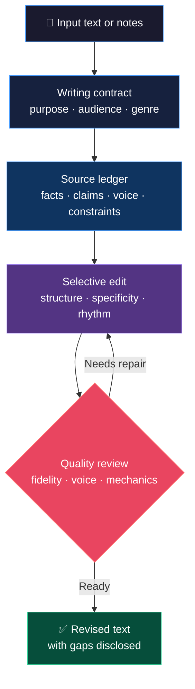
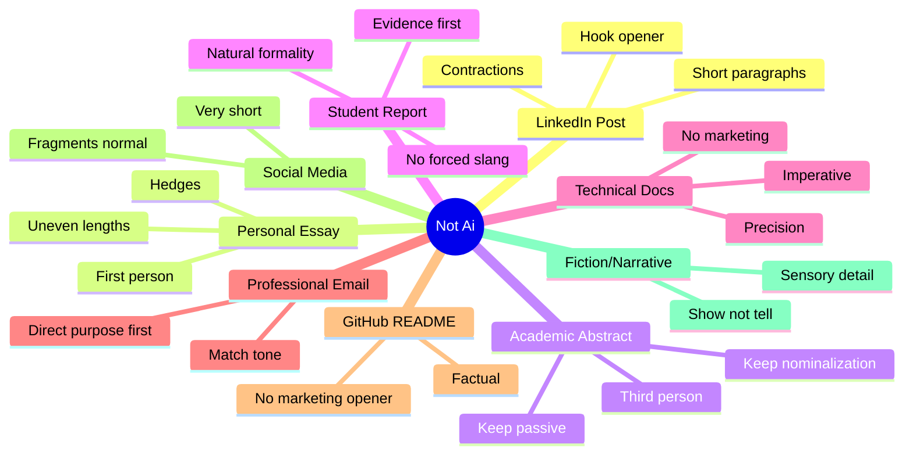
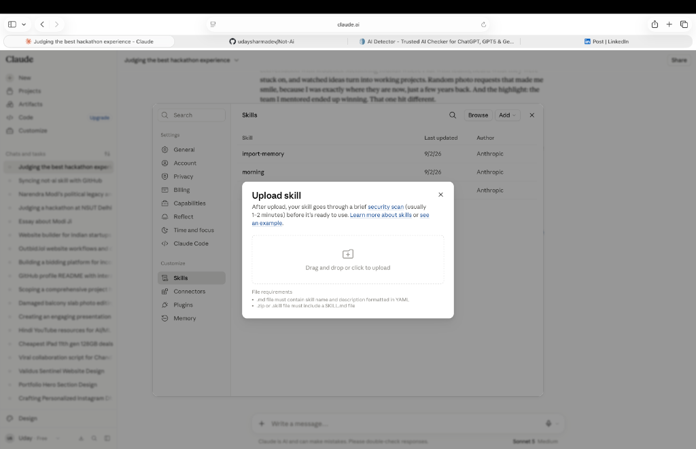
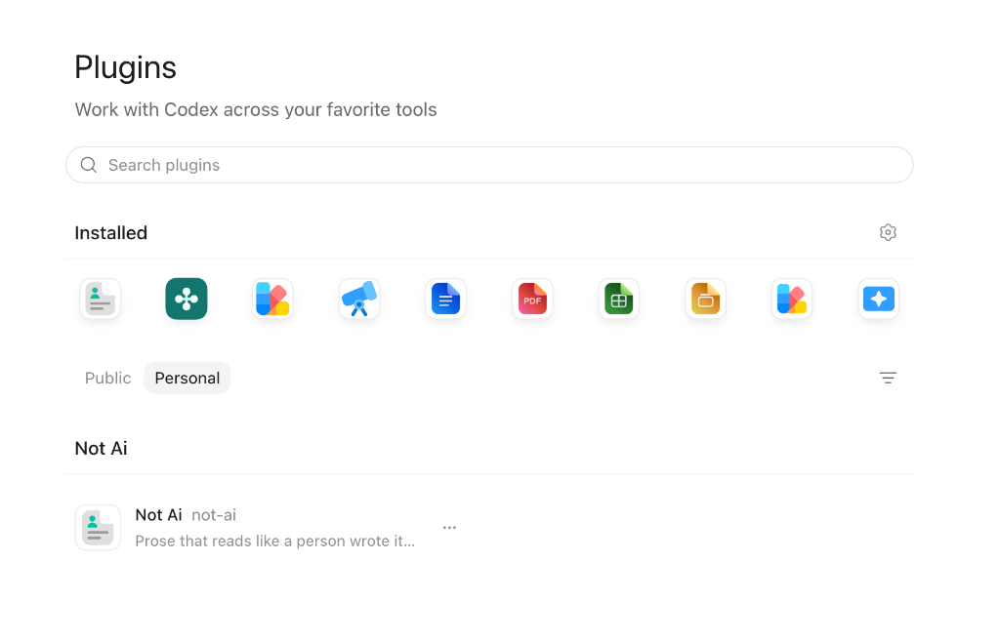

<div align="center">


<h1>Not Ai</h1>

<p><strong>A source-grounded Agent Skill for clear, specific, voice-preserving prose.</strong></p>

<p><em>It edits the paragraph's purpose, structure, and voice.<br>It does not disguise authorship.</em></p>

<br>

[](LICENSE)
[](scripts/)
[](plugins/not-ai/skills/not-ai/SKILL.md)
[](plugins/not-ai/skills/not-ai/SKILL.md)
[](https://github.com/udaysharmadev/Not-Ai)
[](https://skills.sh/udaysharmadev/not-Ai)

<br>

> **Not Ai is not a detector-bypass tool.**
> The goal is good writing, by human standards, for human readers.

</div>

---

## Install in one command

```bash
npx skills add udaysharmadev/Not-Ai
```

Works with Claude Code, Codex, Antigravity, Cursor, GitHub Copilot, Windsurf,
Gemini, and 20+ other agents.

## Why it's different

Not Ai first protects facts, claims, citations, terminology, and the writer's
actual position. It then edits paragraph purpose, information order, agency,
specificity, rhythm, and register. A deterministic gate supports editorial
review without pretending to determine authorship or writing quality.

## Star History

[](https://www.star-history.com/#udaysharmadev/Not-Ai&Date)

## One editing example

The example below keeps the supplied names, place, sequence, and concrete
details. It removes the generic opening and leads with the scene instead.

### Original (ChatGPT output)

> *"Personally, this was the best hackathon I've ever been part of – and I was there as a judge, not a participant. Nagpur, Central India Hackathon 2.0. 3 days that honestly felt like a movie. It started right from home, suitcase in hand, saying bye to mummy-papa, and papa walking me till the cab. A small moment, but it set the tone. Even when you travel for work, those goodbyes carry a different warmth. By the time I landed in Nagpur, the organizers were already waiting at the airport. First stop? Poha in the rain. And then entering the college to see a 10-foot poster of me at the gate. I don't think I'll ever forget that feeling..."*

### After Not Ai

> *"Suitcase in hand, I said bye to mummy and papa, and papa walked me all the way to the cab. Small moment, but it set the tone, because even when you're travelling for work, those goodbyes carry something different. By the time I landed in Nagpur for Central India Hackathon 2.0, the organizers were already waiting at the airport. First stop: poha in the rain. Then walking into the college and seeing a 10 foot poster of me at the gate, a feeling I don't think wears off..."*

**What changed:** the opener moved from a general claim to a supplied concrete
scene. Specific details such as poha in the rain and the 10-foot poster now
carry the paragraph. No new memory, emotion, or event was added.

---

## Why this exists

Word swapping cannot fix unclear purpose, generic claims, weak information
order, or a missing point of view. Not Ai works at those levels while treating
the source as a constraint rather than raw material to embellish.

A 2025 PNAS study ([Reinhert et al.](https://arxiv.org/abs/2410.16107)) measured 66 morphosyntactic features across 17,905 texts. The differences were structural, not just vocabulary:

| Pattern | LLM rate vs. human |
|---|---|
| Present participial clause openers | **224% to 527%** of human rate |
| Nominalization density (`-tion`, `-ment`, `-ness`) | **145% to 214%** of human rate |
| Past participial clauses | **150% to 307%** of human rate |
| Phrasal co-ordination | **144% to 194%** of human rate |
| Contractions (conversational) | **measurably below** human rate |
| Hedging phrases (`probably`, `I think`) | **50 to 67%** of human rate |
| Tier 1 vocabulary (`camaraderie`, `palpable`, `tapestry`) | **84 to 171x** human rate |

The research is useful as editorial evidence, not as a recipe for manufacturing
a statistical profile. A feature that is common in model output may still be
the right choice for a particular author, genre, or sentence.

---

## How it works



### Three passes

**Pass 1: Protect.** Record facts, claims, quotations, citations, terminology,
and genuine voice choices that must survive.

**Pass 2: Edit.** Give each paragraph a job, lead with useful information,
replace abstraction with supported detail, clarify agency, and tune rhythm to
the genre.

**Pass 3: Review.** Check fidelity, unsupported additions, purpose, voice,
logic, protected content, and mechanics. A strong passage may need no rewrite.

---

## Pre-output validation

The gate blocks empty output and explicitly missing protected text. Typography,
vocabulary, openings, rhythm, participial openers, and contractions are review
findings by default. An ASCII-only punctuation rule is available when a writer
or publication actually requires that house style.

```bash
python3 scripts/gate.py draft.txt --genre linkedin
python3 plugins/not-ai/tools/gate.py draft.txt --genre academic --protect "p = 0.03" --json
python3 scripts/gate.py draft.txt --genre readme --ascii-punctuation
```

Valid profiles: `linkedin`, `personal`, `email`, `social`, `fiction`, `readme`,
`technical`, `student`, and `academic`. An already-natural passage may validly need no
rewrite.

---

## Nine genre profiles



Genre detection runs first. Every profile still obeys the same fidelity and
no-invention rules.

---

## Vocabulary review


A flagged word can be correct, characteristic, or required by the field. The
review asks what the wording does for this reader; it does not infer authorship.

---

## Install

### Method 1: skills.sh *(recommended, works on all agents)*

```bash
npx skills add udaysharmadev/Not-Ai
```

Works with Claude Code, Cursor, Codex, GitHub Copilot, Windsurf, Gemini, Cline, AMP, and 20+ more agents. Installs to `.agents/skills/` automatically.

---

### Method 2: Claude Marketplace *(for Claude.ai)*


1. Open **Claude.ai** → click your profile → **Plugins** → **Directory**
2. Click **`+ Add marketplace`** (top right of the Directory modal)
3. Paste the URL:
   ```
   https://github.com/udaysharmadev/Not-Ai
   ```
4. Toggle **"Sync automatically"** ON → click **Sync**

Once installed, type `/not-ai` in any Claude conversation to activate. Syncs automatically when the repo updates.

---

### Method 2: Claude Skills (ZIP upload) *(for Claude.ai Skills)*



Claude.ai also supports uploading skills directly via ZIP:

1. Go to **claude.ai** → Settings (bottom-left) → **Customize** → **Skills**
2. Click **Add** → **Upload skill**
3. Download the ZIP from GitHub:
   ```
   https://github.com/udaysharmadev/Not-Ai/archive/refs/heads/main.zip
   ```
4. Drag and drop the ZIP file into the upload dialog

> File requirements shown by Claude: `.md` file must contain skill name and description formatted in YAML · `.zip` or `.skill` file must include a `SKILL.md` file

After upload, the skill goes through a brief security scan (usually 1 to 2 minutes) before it's ready to use.

---

### Method 3: Codex Marketplace *(for OpenAI Codex)*



Not Ai is available as a Personal plugin in Codex, added the same way as Claude via the marketplace URL.

1. Open **Codex** → **Plugins** → click the **`+`** to add a marketplace
2. Paste the GitHub URL:
   ```
   https://github.com/udaysharmadev/Not-Ai
   ```
3. Confirm and sync

Once installed it shows up under **Personal** plugins as **Not Ai · not-ai**, "Prose that reads like a person wrote it..."

---

### Method 4: Claude Code (terminal)

```bash
claude plugin marketplace add udaysharmadev/Not-Ai && claude plugin install not-ai@not-ai
```

---

### Method 5: ZIP file, manual copy *(no git, works everywhere)*

1. Download: [github.com/udaysharmadev/Not-Ai → Code → Download ZIP](https://github.com/udaysharmadev/Not-Ai/archive/refs/heads/main.zip)
2. Extract and copy:

```bash
# Claude Code (reads skills at startup)
cp path/to/Not-Ai/plugins/not-ai/skills/not-ai/SKILL.md ~/.claude/skills/not-ai/SKILL.md

# Claude Desktop (Project Knowledge)
# Upload plugins/not-ai/skills/not-ai/SKILL.md to your Project Knowledge
# Then invoke: "Using the Not Ai skill, rewrite this:"
```

---

### Method 6: Other agents *(Cursor, Windsurf, Aider, Gemini CLI)*

```bash
git clone https://github.com/udaysharmadev/Not-Ai /tmp/not-ai
cp /tmp/not-ai/plugins/not-ai/skills/not-ai/SKILL.md ~/.claude/skills/not-ai/SKILL.md
```

Works with any agent that reads context files at startup.

---

## Usage

```
/not-ai [paste text]                    fast, source-grounded rewrite
/not-ai --mode diagnose [text]          report only, no changes
/not-ai --mode preserve [text]          fewest useful edits
/not-ai --mode voice-match [text]       match supplied author samples
/not-ai write [brief]                   draft only from supplied material
```

### Measurement scripts

```bash
python3 scripts/analyze_structure.py input.txt   # structural measurements
python3 scripts/repetition.py input.txt          # phrase and pattern repetition
python3 scripts/metrics.py input.txt             # readability, density, stance
python3 scripts/measure.py input.txt             # all three in one pass
python3 scripts/gate.py input.txt --genre linkedin # portable pre-output gate
```

---

## Repository structure

```
Not-Ai/
├── plugins/not-ai/
│   ├── .claude-plugin/marketplace.json     Claude marketplace config
│   ├── .codex-plugin/plugin.json           Codex plugin config
│   ├── skills/not-ai/
│       ├── SKILL.md                        Canonical skill instructions
│       └── reference/
│           ├── profile.md
│           ├── vocabulary.md
│           ├── mechanical-tells.md
│           ├── why-word-swapping-fails.md
│           └── research-sources.md
│   └── tools/
│       ├── gate.py                       Portable, genre-aware validation CLI
│       └── not_ai_core/                  Shared deterministic gate logic
│
├── assets/                                 Screenshots and logo
├── scripts/                                Python measurement tools
├── examples/                               6 worked before/after pairs
│   ├── linkedin-post/
│   ├── personal-essay/
│   ├── academic-abstract/
│   ├── technical-passage/
│   ├── gen-ai-article/
│   └── already-natural/
├── benchmarks/                             Evaluation framework
├── tests/                                  Gate, wrapper, and payload regression tests
├── README.md
└── LICENSE
```

---

## Research basis

| Study | Finding used |
|---|---|
| [Reinhart et al., PNAS 2025](https://doi.org/10.1073/pnas.2422455122) | Grammatical and rhetorical differences across model variants and genres |
| [Jiang & Hyland, 2025](https://doi.org/10.1177/07410883251328311) | Reader engagement in student and ChatGPT argumentative essays |
| [Wikipedia: Signs of AI Writing](https://en.wikipedia.org/wiki/Wikipedia:Signs_of_AI_writing) | A changing, context-specific field guide whose signs are not proof |
| [Kobak et al., Science Advances 2025](https://doi.org/10.1126/sciadv.adt3813) | Corpus-level excess vocabulary in biomedical abstracts |
| [Liang et al., Patterns 2023](https://doi.org/10.1016/j.patter.2023.100779) | Detector false positives affecting non-native English writers |

---

## What Not Ai will not do

- Add random typos to seem human
- Force slang into the wrong register
- Invent memories, emotions, or opinions
- Fabricate facts, citations, or statistics
- Optimize for a detector score
- Rewrite everything when selective edits are enough
- Assert that a given text was machine-written

---

## Contributing

Most useful contributions:
- Genre profiles for contexts not yet covered
- Before/after benchmark pairs in any genre
- Consented source packs with purpose, audience, and protected facts
- Blinded human reviews of fidelity, clarity, restraint, and reader usefulness
- Better parsers only when an annotated evaluation shows that they improve
  useful editorial review

The plugin skill is canonical. After editing it, update the local Claude copy
with `python3 scripts/sync_skill.py`; CI checks that the two copies match.

---

## License

MIT. See [LICENSE](LICENSE).

---

<div align="center">
<em>"Remove the machine's generic habits. Preserve the person's voice."</em>
</div>
