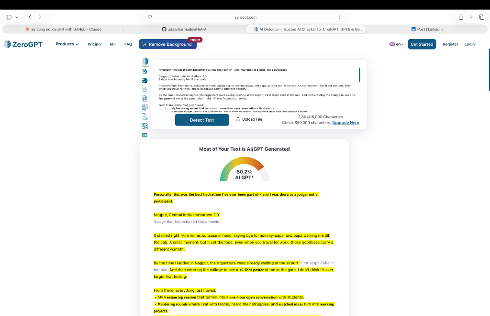
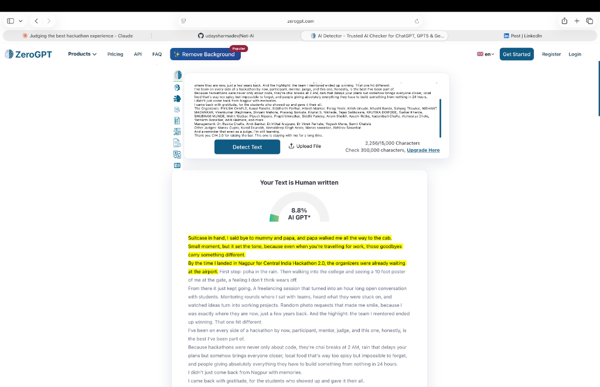
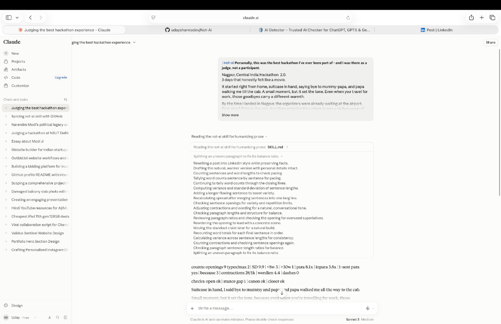
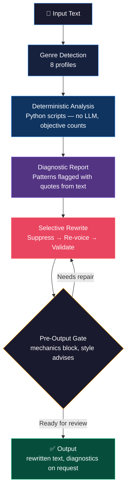
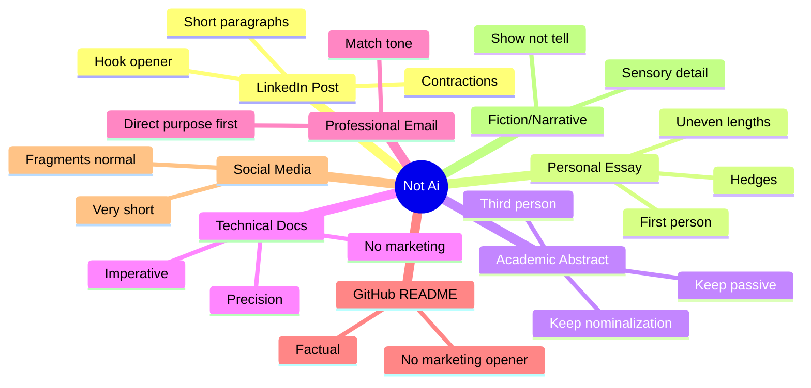
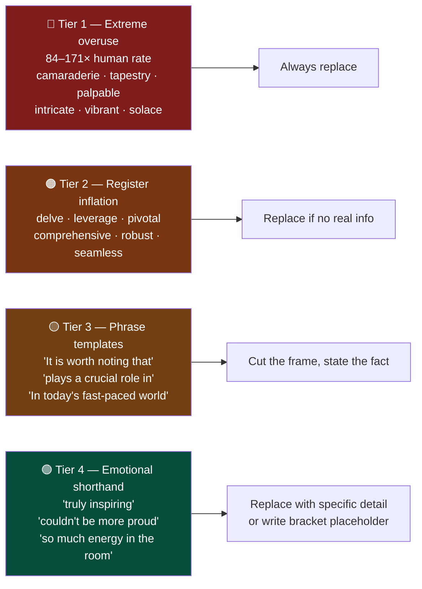

<div align="center">


<h1>Not Ai</h1>

<p><strong>A research-informed Agent Skill that fixes structural patterns in AI writing, not just vocabulary.</strong></p>

<p><em>Every other humanizer swaps words.<br>Not Ai restructures sentences.</em></p>

<br>

[](LICENSE)
[](scripts/)
[](plugins/not-ai/skills/not-ai/SKILL.md)
[](plugins/not-ai/skills/not-ai/SKILL.md)
[](https://github.com/udaysharmadev/Not-Ai)
[](https://skills.sh/udaysharmadev/not-Ai)

<br>

> **Not Ai is not a detector-bypass tool.**
> The goal is good writing, by human standards, for human readers.

</div>

---

## Install in one command

```bash
npx skills add udaysharmadev/Not-Ai
```

Works with Claude Code, Codex, Antigravity, Cursor, GitHub Copilot, Windsurf,
Gemini, and 20+ other agents.

## Why it's different

Most humanizers mainly replace words. Not Ai analyzes sentence structure,
rewrites selectively, then validates the result with deterministic diagnostics
and genre-aware checks.

## One observed test

A LinkedIn post written by ChatGPT scored **80.2% AI** in one ZeroGPT test.
The same post, rewritten using the Not Ai skill in Claude, scored **8.8%** in
that test. This is one observed before/after result, not a guaranteed detector
outcome or a promise that the tool bypasses detection.

Same facts. Same names. Same story. Different structure.

<table>
<tr>
<td width="50%">

**Before: 80.2% AI detected**



</td>
<td width="50%">

**After: 8.8% AI detected**



</td>
</tr>
</table>

### Original (ChatGPT output)

> *"Personally, this was the best hackathon I've ever been part of – and I was there as a judge, not a participant. Nagpur, Central India Hackathon 2.0. 3 days that honestly felt like a movie. It started right from home, suitcase in hand, saying bye to mummy-papa, and papa walking me till the cab. A small moment, but it set the tone. Even when you travel for work, those goodbyes carry a different warmth. By the time I landed in Nagpur, the organizers were already waiting at the airport. First stop? Poha in the rain. And then entering the college to see a 10-foot poster of me at the gate. I don't think I'll ever forget that feeling..."*

### After Not Ai (8.8% AI)

> *"Suitcase in hand, I said bye to mummy and papa, and papa walked me all the way to the cab. Small moment, but it set the tone, because even when you're travelling for work, those goodbyes carry something different. By the time I landed in Nagpur for Central India Hackathon 2.0, the organizers were already waiting at the airport. First stop: poha in the rain. Then walking into the college and seeing a 10 foot poster of me at the gate, a feeling I don't think wears off..."*

**What changed:** opener moved from a general statement to a concrete scene. Participial openers removed. Nominalizations dropped. Contractions restored. Specific details (poha in the rain, 10-foot poster) lead each paragraph instead of trailing it.

Here is the skill running inside Claude, reading SKILL.md, running diagnostics sentence by sentence, and printing internal counts before delivery:



---

## Why this exists

Every major humanizer works the same way: find banned words, swap them, optionally paraphrase. The output still reads like AI because the structure was never touched.

A 2025 PNAS study ([Reinhert et al.](https://arxiv.org/abs/2410.16107)) measured 66 morphosyntactic features across 17,905 texts. The differences were structural, not just vocabulary:

| Pattern | LLM rate vs. human |
|---|---|
| Present participial clause openers | **224% to 527%** of human rate |
| Nominalization density (`-tion`, `-ment`, `-ness`) | **145% to 214%** of human rate |
| Past participial clauses | **150% to 307%** of human rate |
| Phrasal co-ordination | **144% to 194%** of human rate |
| Contractions (conversational) | **measurably below** human rate |
| Hedging phrases (`probably`, `I think`) | **50 to 67%** of human rate |
| Tier 1 vocabulary (`camaraderie`, `palpable`, `tapestry`) | **84 to 171x** human rate |

**Key finding: the fingerprint comes from instruction tuning, not model scale.** Base Llama 3 sits at 94 to 102% of human rates. Instruction-tuned variants diverge sharply. Word-swapping fails because the issue is sentence architecture.

---

## How it works



### Three passes, not one

**Pass 1: Suppress**
Remove patterns that betray AI generation:
- Present participial openers (`"Building on this..."`, `"Leveraging scale..."`)
- Nominalizations that inflate sentence weight
- Mechanical transitions (`Furthermore,` `Moreover,` `It is worth noting that`)
- Copula avoidance (`serves as`, `functions as`, `marks`, when meaning is just `is`)
- Balanced lists (`Supporters say X. Critics say Y.`)
- Fact-stacking (3+ facts crammed into one sentence)

**Pass 2: Re-voice**
This is the pass that matters. Rewrite as if speaking to someone who already knows the context:
- Restore contractions in conversational registers
- Restore `because`, existential `there`, sentence-initial `And`/`But`
- Break balanced lists: pick a side, or make the symmetry asymmetric
- Split fact-stacked sentences: one or two facts per sentence
- Preserve source-backed stance: do not manufacture opinions or emotion
- Replace emotional shorthand with the specific detail it stands in for
- Cut tricolons where the third item exists only for cadence
- Break word-level predictability: use a name, a number, or an unusual adjective where the model would pick a safe one
- Preserve genuine asides or repetitions: do not inject fake imperfections

**Pass 3: Validate**
Run deterministic measurement scripts and the genre-aware gate. Resolve hard
mechanical errors, then use advisory findings as prompts for editorial review.

---

## Pre-output validation

The gate is deterministic about mechanics and deliberately cautious about
style. It blocks empty text, em/en dashes, and curly quotes. It reports
vocabulary, openings, rhythm, participial openers, and contractions as review
findings that an editor assesses in genre context. It does not claim to prove
authorship, fidelity, or a detector result.

```bash
python3 scripts/gate.py draft.txt --genre linkedin
python3 plugins/not-ai/tools/gate.py draft.txt --genre academic --json
```

Valid profiles: `linkedin`, `personal`, `email`, `social`, `fiction`, `readme`,
`technical`, and `academic`. An already-natural passage may validly need no
rewrite.

---

## Eight genre profiles



Genre detection runs first. Each profile has **red lines** that cannot be crossed regardless of what other fixes apply.

---

## Vocabulary tiers



Words also shift by model era. The wordlist tracks which patterns belong to GPT-4, GPT-4o, GPT-5, and Grok so the right fix is applied at the right level.

---

## Install

### Method 1: skills.sh *(recommended, works on all agents)*

```bash
npx skills add udaysharmadev/Not-Ai
```

Works with Claude Code, Cursor, Codex, GitHub Copilot, Windsurf, Gemini, Cline, AMP, and 20+ more agents. Installs to `.agents/skills/` automatically.

---

### Method 2: Claude Marketplace *(for Claude.ai)*


1. Open **Claude.ai** → click your profile → **Plugins** → **Directory**
2. Click **`+ Add marketplace`** (top right of the Directory modal)
3. Paste the URL:
   ```
   https://github.com/udaysharmadev/Not-Ai
   ```
4. Toggle **"Sync automatically"** ON → click **Sync**

Once installed, type `/not-ai` in any Claude conversation to activate. Syncs automatically when the repo updates.

---

### Method 2: Claude Skills (ZIP upload) *(for Claude.ai Skills)*


Claude.ai also supports uploading skills directly via ZIP:

1. Go to **claude.ai** → Settings (bottom-left) → **Customize** → **Skills**
2. Click **Add** → **Upload skill**
3. Download the ZIP from GitHub:
   ```
   https://github.com/udaysharmadev/Not-Ai/archive/refs/heads/main.zip
   ```
4. Drag and drop the ZIP file into the upload dialog

> File requirements shown by Claude: `.md` file must contain skill name and description formatted in YAML · `.zip` or `.skill` file must include a `SKILL.md` file

After upload, the skill goes through a brief security scan (usually 1 to 2 minutes) before it's ready to use.

---

### Method 3: Codex Marketplace *(for OpenAI Codex)*


Not Ai is available as a Personal plugin in Codex, added the same way as Claude via the marketplace URL.

1. Open **Codex** → **Plugins** → click the **`+`** to add a marketplace
2. Paste the GitHub URL:
   ```
   https://github.com/udaysharmadev/Not-Ai
   ```
3. Confirm and sync

Once installed it shows up under **Personal** plugins as **Not Ai · not-ai**, "Prose that reads like a person wrote it..."

---

### Method 4: Claude Code (terminal)

```bash
claude plugin marketplace add udaysharmadev/Not-Ai && claude plugin install not-ai@not-ai
```

---

### Method 5: ZIP file, manual copy *(no git, works everywhere)*

1. Download: [github.com/udaysharmadev/Not-Ai → Code → Download ZIP](https://github.com/udaysharmadev/Not-Ai/archive/refs/heads/main.zip)
2. Extract and copy:

```bash
# Claude Code (reads skills at startup)
cp path/to/Not-Ai/plugins/not-ai/skills/not-ai/SKILL.md ~/.claude/skills/not-ai/SKILL.md

# Claude Desktop (Project Knowledge)
# Upload plugins/not-ai/skills/not-ai/SKILL.md to your Project Knowledge
# Then invoke: "Using the Not Ai skill, rewrite this:"
```

---

### Method 6: Other agents *(Cursor, Windsurf, Aider, Gemini CLI)*

```bash
git clone https://github.com/udaysharmadev/Not-Ai /tmp/not-ai
cp /tmp/not-ai/plugins/not-ai/skills/not-ai/SKILL.md ~/.claude/skills/not-ai/SKILL.md
```

Works with any agent that reads context files at startup.

---

## Usage

```
/not-ai [paste text]                    default rewrite
/not-ai --mode diagnose [text]          report only, no changes
/not-ai --mode preserve [text]          fewest word-level edits
/not-ai --mode aggressive [text]        full structural surgery
/not-ai write [brief]                   write from scratch
```

### Measurement scripts

```bash
python3 scripts/analyze_structure.py input.txt   # structural fingerprint
python3 scripts/repetition.py input.txt          # phrase and pattern repetition
python3 scripts/metrics.py input.txt             # readability, density, stance
python3 scripts/measure.py input.txt             # all three in one pass
python3 scripts/gate.py input.txt --genre linkedin # portable pre-output gate
```

---

## Repository structure

```
Not-Ai/
├── plugins/not-ai/
│   ├── .claude-plugin/marketplace.json     Claude marketplace config
│   ├── .codex-plugin/plugin.json           Codex plugin config
│   ├── skills/not-ai/
│       ├── SKILL.md                        Canonical skill instructions
│       └── reference/
│           ├── profile.md
│           ├── vocabulary.md
│           ├── mechanical-tells.md
│           ├── why-word-swapping-fails.md
│           └── research-sources.md
│   └── tools/
│       ├── gate.py                       Portable, genre-aware validation CLI
│       └── not_ai_core/                  Shared deterministic gate logic
│
├── assets/                                 Screenshots and logo
├── scripts/                                Python measurement tools
├── examples/                               6 worked before/after pairs
│   ├── linkedin-post/
│   ├── personal-essay/
│   ├── academic-abstract/
│   ├── technical-passage/
│   ├── gen-ai-article/
│   └── already-natural/
├── benchmarks/                             Evaluation framework
├── tests/                                  Gate, wrapper, and payload regression tests
├── README.md
└── LICENSE
```

---

## Research basis

| Study | Finding used |
|---|---|
| [Reinhert et al., PNAS 2025](https://arxiv.org/abs/2410.16107) | Present participial rates, nominalization density, instruction tuning as root cause, Tier 1 vocabulary |
| [Jiang & Hyland, 2025](https://www.sciencedirect.com/science/article/pii/S0889490624000978) | Engagement marker deficit, epistemic stance, fewer hedges and personal asides |
| [Wikipedia: Signs of AI Writing](https://en.wikipedia.org/wiki/Wikipedia:Signs_of_AI_writing) | Copula avoidance, negative parallelism, rule of three, vocabulary by model era |
| [Kobak et al., Science Advances 2025](https://www.science.org/doi/10.1126/sciadv.adn6844) | Confirmed `delve`, `leverage`, `pivotal`, `underscore` overuse post-2022 |
| [The Economist, July 2026](https://www.economist.com/) | Em dash, negative parallelism, rule of three as 2026 signals |

---

## What Not Ai will not do

- Add random typos to seem human
- Force slang into the wrong register
- Invent memories, emotions, or opinions
- Fabricate facts, citations, or statistics
- Optimize for a detector score
- Rewrite everything when selective edits are enough
- Assert that a given text was machine-written

---

## Contributing

Most useful contributions:
- Genre profiles for contexts not yet covered
- Before/after benchmark pairs in any genre
- Updated vocabulary lists as new model behavior is documented
- spaCy or NLTK integration for real morphosyntactic parsing

The plugin skill is canonical. After editing it, update the local Claude copy
with `python3 scripts/sync_skill.py`; CI checks that the two copies match.

---

## License

MIT. See [LICENSE](LICENSE).

---

<div align="center">
<em>"Remove the machine's generic habits. Preserve the person's voice."</em>
</div>
