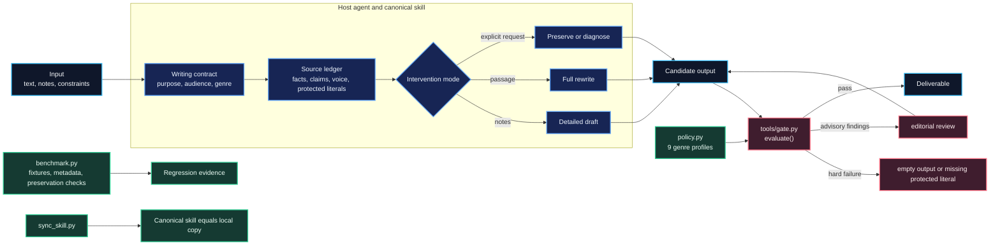
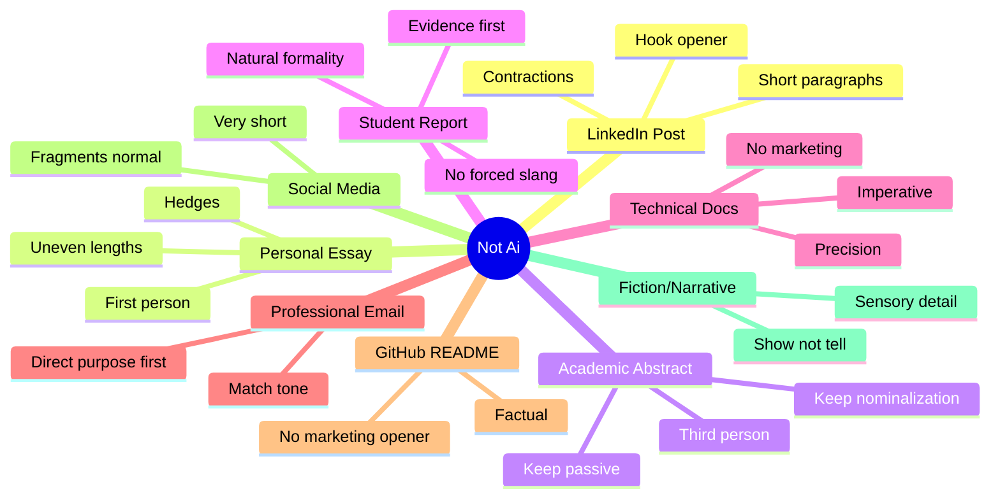
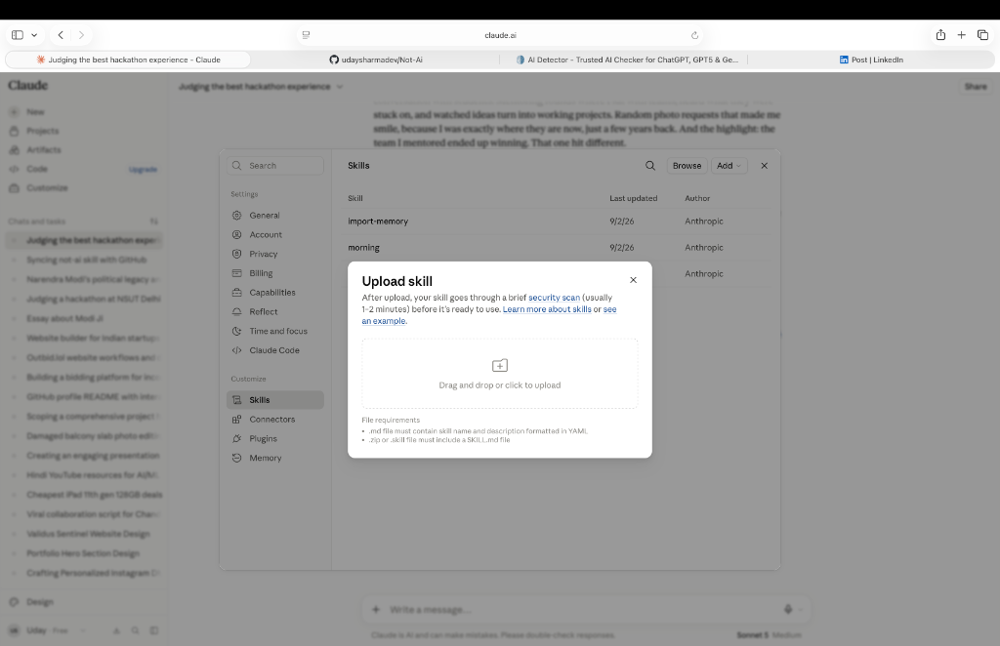
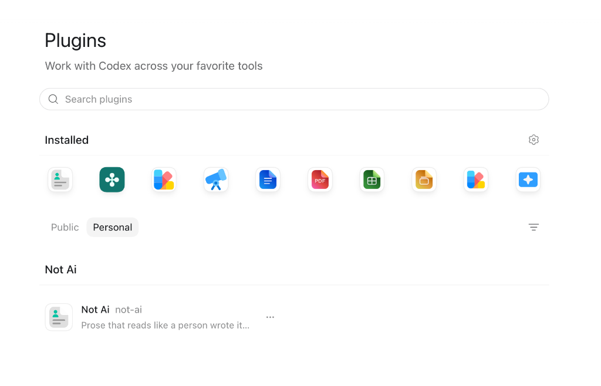

<div align="center">


<h1>Not Ai</h1>

<p><strong>A source-grounded Agent Skill for clear, specific, voice-preserving prose.</strong></p>

<p><em>It edits the paragraph's purpose, structure, and voice.<br>It does not disguise authorship.</em></p>

<br>

[](LICENSE)
[](scripts/)
[](plugins/not-ai/skills/not-ai/SKILL.md)
[](plugins/not-ai/skills/not-ai/SKILL.md)
[](https://github.com/udaysharmadev/Not-Ai)
[](https://skills.sh/udaysharmadev/not-Ai)

<br>

> **Not Ai is not a detector-bypass tool.**
> The goal is good writing, by human standards, for human readers.

</div>

---

## Install in one command

```bash
npx skills add udaysharmadev/Not-Ai
```

Works with Claude Code, Codex, Antigravity, Cursor, GitHub Copilot, Windsurf,
Gemini, and 20+ other agents.

## Why it's different

Not Ai first protects facts, claims, citations, terminology, and the writer's
actual position. It then edits paragraph purpose, information order, agency,
specificity, rhythm, and register. A deterministic gate supports editorial
review without pretending to determine authorship or writing quality.

## Star History

[](https://www.star-history.com/#udaysharmadev/Not-Ai&Date)

## How it works

Not Ai has two layers: an editorial contract executed by the host agent, and a
dependency-free Python gate that provides deterministic checks. It is not a
text-generation model, an authorship classifier, or a detector bypasser.


```mermaid
flowchart LR
    I["Input<br/>text, notes, constraints"] --> C["Writing contract<br/>purpose, audience, genre"]
    C --> L["Source ledger<br/>facts, claims, voice, protected literals"]
    L --> M{"Intervention mode"}
    M -->|"notes"| D["Detailed draft"]
    M -->|"passage"| R["Full rewrite"]
    M -->|"explicit request"| P["Preserve or diagnose"]
    D --> O["Candidate output"]
    R --> O
    P --> O

    subgraph Runtime["Host agent and canonical skill"]
        C
        L
        M
        D
        R
        P
    end

    O --> G["tools/gate.py<br/>evaluate()"]
    Policy["policy.py<br/>9 genre profiles"] --> G
    G -->|"hard failure"| X["empty output or missing protected literal"]
    G -->|"advisory findings"| Q["editorial review"]
    Q --> O
    G -->|"pass"| F["Deliverable"]

    B["benchmark.py<br/>fixtures, metadata, preservation checks"] --> T["Regression evidence"]
    S["sync_skill.py"] --> K["Canonical skill equals local copy"]

    classDef input fill:#0f172a,stroke:#38bdf8,color:#f8fafc,stroke-width:2px
    classDef runtime fill:#172554,stroke:#60a5fa,color:#eff6ff,stroke-width:2px
    classDef gate fill:#3f1d2e,stroke:#fb7185,color:#fff1f2,stroke-width:2px
    classDef evidence fill:#153a32,stroke:#34d399,color:#ecfdf5,stroke-width:2px
    class I,O,F input
    class C,L,M,D,R,P runtime
    class G,X,Q gate
    class B,T,S,K,Policy evidence
```

For a high-resolution, interactive version of this architecture, open the
[technical pipeline diagram](docs/not-ai-technical-pipeline.html).

### 1. Editorial contract and source model

The host agent reads
[`plugins/not-ai/skills/not-ai/SKILL.md`](plugins/not-ai/skills/not-ai/SKILL.md).
The skill builds a writing contract with purpose, audience, genre, register,
and protected content. It then creates a source ledger that keeps facts,
claims, quotations, citations, terminology, formatting constraints, and voice
evidence separate from unsupported gaps.

The mode is selected from the input shape, not an arbitrary speed setting:
notes produce a detailed draft from supplied material, while a supplied passage
receives a full rewrite. `preserve`, `diagnose`, and `voice-match` remain
explicit opt-in modes. Missing information becomes a bracketed prompt rather
than a fabricated detail.

### 2. Deterministic pre-output gate

[`plugins/not-ai/tools/gate.py`](plugins/not-ai/tools/gate.py) accepts a file
or standard input and calls `not_ai_core.gate.evaluate()`. The repository
wrapper at [`scripts/gate.py`](scripts/gate.py) exposes the same tool from the
project root. The gate uses the composable profiles in
[`policy.py`](plugins/not-ai/tools/not_ai_core/policy.py): `linkedin`,
`personal`, `email`, `social`, `x`, `fiction`, `readme`, `technical`,
`procedure`, `api`, `tutorial`, `student`, `academic`, `abstract`, `proposal`,
`executive`, `marketing`, and `essay` (the original nine behave exactly as before).

It fails only for empty output and explicitly missing `--protect` literals.
Typography, vocabulary tiers, templated transitions, participial openers,
sentence openings, rhythm, and choppy runs are advisory findings. The gate does
not claim factual fidelity, semantic equivalence, authorship, or writing
quality. The skill separately requires a final scan that removes em dashes from
newly authored prose.

### 3. Regression and packaging checks

[`scripts/benchmark.py`](scripts/benchmark.py) evaluates human-provided
original and rewritten pairs. It reports token-overlap proxy, structural delta,
readability delta, word-count change, protected-literal preservation, and the
expected action from fixture metadata. These are reproducible diagnostics, not
claims that a rewrite is good or semantically identical.

The plugin ships its own gate implementation. `scripts/sync_skill.py` verifies
that `.claude/skills/not-ai.md` is byte-identical to the canonical plugin skill,
and the unit suite exercises the gate, benchmark fixtures, package layout, and
sync check.

---

## Why this exists

Word swapping cannot fix unclear purpose, generic claims, weak information
order, or a missing point of view. Not Ai works at those levels while treating
the source as a constraint rather than raw material to embellish.

A 2025 PNAS study ([Reinhart et al.](https://arxiv.org/abs/2410.16107)) measured 66 morphosyntactic features across 17,905 texts. The differences were structural, not just vocabulary. These are population rates in the studied corpora — useful as editorial prompts, never as targets for an individual document:

| Pattern | LLM rate vs. human | Not-AI interpretation | Limitation |
|---|---|---|---|
| Present participial clause openers | **224% to 527%** of human rate | Review whether the opener earns its complexity | Regex proxy, not a parse; academic prose may keep more |
| Nominalization density (`-tion`, `-ment`, `-ness`) | **145% to 214%** of human rate | Unpack only where the source supports verbs | Proxy over-counts ~5×; never compare to the tagged 14.6/1k |
| Past participial clauses | **150% to 307%** of human rate | Check actor visibility | Proxy only |
| Phrasal co-ordination | **144% to 194%** of human rate | Check whether the third item carries content | Genre-relative |
| Contractions (conversational) | **measurably below** human rate | Advisory in conversational genres only | Writer habit overrules |
| Hedging phrases (`probably`, `I think`) | **50 to 67%** of human rate | Review stance fit in argumentative genres | Never insert to hit a number |
| Tier 1 vocabulary (`camaraderie`, `palpable`, `tapestry`) | **84 to 171x** human rate | Corpus-level cluster prompt; keep precise/characteristic uses | One occurrence is rarely a problem |

The research is useful as editorial evidence, not as a recipe for manufacturing
a statistical profile. A feature that is common in model output may still be
the right choice for a particular author, genre, or sentence. Humans vary by genre, culture, language background, author, purpose, and publication — Not-AI uses evidence as an editorial lens, not a statistical costume. Full provenance lives in [`docs/research/evidence-registry.md`](docs/research/evidence-registry.md).

---

## Pre-output validation

The gate blocks empty output and explicitly missing protected text. Typography,
vocabulary, openings, rhythm, participial openers, and contractions are review
findings by default. An ASCII-only punctuation rule is available when a writer
or publication actually requires that house style.

```bash
python3 scripts/gate.py draft.txt --genre linkedin
python3 plugins/not-ai/tools/gate.py draft.txt --genre academic --protect "p = 0.03" --json
python3 scripts/gate.py draft.txt --genre readme --ascii-punctuation
python3 scripts/gate.py draft.txt --explain nominalization-density
python3 scripts/ste_check.py file.txt --mode inspired
```

Valid profiles: `linkedin`, `personal`, `email`, `social`, `x`, `fiction`,
`readme`, `technical`, `procedure`, `api`, `tutorial`, `student`, `academic`,
`abstract`, `proposal`, `executive`, `marketing`, `essay`. An already-natural passage may validly need no
rewrite.

---

## Eighteen genre profiles (composable dimensions)


```mermaid
mindmap
  root((Not Ai))
    LinkedIn Post
      Hook opener
      Contractions
      Short paragraphs
    Personal Essay
      First person
      Hedges
      Uneven lengths
    Academic Abstract
      Keep passive
      Keep nominalization
      Third person
    Student Report
      Evidence first
      Natural formality
      No forced slang
    Technical Docs
      Imperative
      Precision
      No marketing
    Professional Email
      Match tone
      Direct purpose first
    GitHub README
      Factual
      No marketing opener
    Social Media
      Fragments normal
      Very short
    Fiction/Narrative
      Show not tell
      Sensory detail
```

Genre detection runs first. Every profile still obeys the same fidelity and
no-invention rules. All profiles, measures, and vocabulary lists are
English-optimized; for other languages, keep fidelity and treat stylistic
findings as tentative.

---

## Vocabulary review


```mermaid
graph LR
    T1["Corpus pattern\nclusters of repeatedly favored words"]
    T2["Reader question\ndoes the phrase carry a precise claim?"]
    T3["Source check\nis evidence or a concrete detail available?"]
    T4["Editorial choice\nkeep, clarify, cut, or ask the writer"]

    T1 --> T2
    T2 --> T3
    T3 --> T4

    style T1 fill:#7f1d1d,color:#fff
    style T2 fill:#78350f,color:#fff
    style T3 fill:#713f12,color:#fff
    style T4 fill:#064e3b,color:#fff
```

A flagged word can be correct, characteristic, or required by the field. The
review asks what the wording does for this reader; it does not infer authorship.

---

## Install

### Method 1: skills.sh *(recommended, works on all agents)*

```bash
npx skills add udaysharmadev/Not-Ai
```

Works with Claude Code, Cursor, Codex, GitHub Copilot, Windsurf, Gemini, Cline, AMP, and 20+ more agents. Installs to `.agents/skills/` automatically.

---

### Method 2: Claude Marketplace *(for Claude.ai)*


1. Open **Claude.ai** → click your profile → **Plugins** → **Directory**
2. Click **`+ Add marketplace`** (top right of the Directory modal)
3. Paste the URL:
   ```
   https://github.com/udaysharmadev/Not-Ai
   ```
4. Toggle **"Sync automatically"** ON → click **Sync**

Once installed, type `/not-ai` in any Claude conversation to activate. Syncs automatically when the repo updates.

---

### Method 3: Claude Skills (ZIP upload) *(for Claude.ai Skills)*



Claude.ai also supports uploading skills directly via ZIP:

1. Go to **claude.ai** → Settings (bottom-left) → **Customize** → **Skills**
2. Click **Add** → **Upload skill**
3. Download the ZIP from GitHub:
   ```
   https://github.com/udaysharmadev/Not-Ai/archive/refs/heads/main.zip
   ```
4. Drag and drop the ZIP file into the upload dialog

> File requirements shown by Claude: `.md` file must contain skill name and description formatted in YAML · `.zip` or `.skill` file must include a `SKILL.md` file

After upload, the skill goes through a brief security scan (usually 1 to 2 minutes) before it's ready to use.

---

### Method 4: Codex Marketplace *(for OpenAI Codex)*



Not Ai is available as a Personal plugin in Codex, added the same way as Claude via the marketplace URL.

1. Open **Codex** → **Plugins** → click the **`+`** to add a marketplace
2. Paste the GitHub URL:
   ```
   https://github.com/udaysharmadev/Not-Ai
   ```
3. Confirm and sync

Once installed it shows up under **Personal** plugins as **Not Ai · not-ai**, "Prose that reads like a person wrote it..."

---

### Method 5: Claude Code (terminal)

```bash
claude plugin marketplace add udaysharmadev/Not-Ai && claude plugin install not-ai@not-ai
```

---

### Method 6: ZIP file, manual copy *(no git, works everywhere)*

1. Download: [github.com/udaysharmadev/Not-Ai → Code → Download ZIP](https://github.com/udaysharmadev/Not-Ai/archive/refs/heads/main.zip)
2. Extract and copy:

```bash
# Claude Code (reads skills at startup)
cp path/to/Not-Ai/plugins/not-ai/skills/not-ai/SKILL.md ~/.claude/skills/not-ai/SKILL.md

# Claude Desktop (Project Knowledge)
# Upload plugins/not-ai/skills/not-ai/SKILL.md to your Project Knowledge
# Then invoke: "Using the Not Ai skill, rewrite this:"
```

---

### Method 7: Other agents *(Cursor, Windsurf, Aider, Gemini CLI)*

```bash
git clone https://github.com/udaysharmadev/Not-Ai /tmp/not-ai
cp /tmp/not-ai/plugins/not-ai/skills/not-ai/SKILL.md ~/.claude/skills/not-ai/SKILL.md
```

Works with any agent that reads context files at startup.

---

## Usage

Three steps, no configuration:

```bash
npx skills add udaysharmadev/Not-Ai   # 1. install (picks the right folder)
```

2. Paste a passage and say what it is for (genre + reader).
3. Read the result against the source: every kept fact, every bracket you
   must fill yourself, every cut you can reject.

```
/not-ai [paste text]                    source-grounded rewrite
/not-ai --mode diagnose [text]          report only, no changes
/not-ai --mode preserve [text]          fewest useful edits
/not-ai --mode voice-match [text]       match supplied author samples
/not-ai write [brief]                   draft only from supplied material
```

### Measurement scripts

```bash
python3 scripts/analyze_structure.py input.txt   # structural measurements
python3 scripts/repetition.py input.txt          # phrase and pattern repetition
python3 scripts/metrics.py input.txt             # readability, density, stance
python3 scripts/measure.py input.txt             # all three in one pass
python3 scripts/gate.py input.txt --genre linkedin # portable pre-output gate
```

### Review scripts

```bash
python3 scripts/diagnose.py draft.txt --genre linkedin        # diagnose without rewriting (now with MTLD/HD-D, cohesion, plain-language, variety)
python3 scripts/diagnose.py draft.txt --genre academic --json # structured diagnosis
python3 scripts/voice_profile.py --reference author.txt --draft draft.txt  # voice drift check with reference_quality tiers
python3 scripts/longdoc.py doc.md --genre technical           # document map + section review + global pass
python3 scripts/flag_response.py --tpr 0.99 --fpr 0.01        # flag math, not a verdict
python3 plugins/not-ai/tools/gate.py draft.txt --genre linkedin --explain  # rule notes
python3 plugins/not-ai/tools/gate.py draft.txt --explain nominalization-density  # one rule's provenance
python3 scripts/ste_check.py file.txt --mode inspired        # STE-inspired (provisional, never compliance)
```

---

## Repository structure

```
Not-Ai/
├── plugins/not-ai/
│   ├── .claude-plugin/plugin.json            Claude marketplace config
│   ├── .codex-plugin/plugin.json             Codex plugin config
│   ├── skills/not-ai/
│       ├── SKILL.md                          Canonical skill instructions (3.0: 14-step pipeline)
│       └── reference/
│           ├── profile.md
│           ├── vocabulary.md
│           ├── mechanical-tells.md
│           ├── why-word-swapping-fails.md
│           ├── research-sources.md
│           ├── voice-persistence.md
│           ├── longform.md
│           ├── detector-literacy.md
│           ├── multilingual.md
│           ├── asd-ste100.md                 STE-inspired vs verified (Issue 9)
│           ├── cultural-and-language-variation.md
│           ├── discourse-cohesion.md
│           ├── plain-language.md
│           ├── information-structure.md
│           └── fidelity.md
│   └── tools/
│       ├── gate.py                           Portable CLI (now with --explain <rule> provenance)
│       └── not_ai_core/                      Deterministic core (stdlib-only base)
│           ├── gate.py                       Mechanical gate (hard-fail surface unchanged)
│           ├── rules.py                      Rule taxonomy + provenance metadata
│           ├── evidence.py                   Evidence-registry loader
│           ├── policy.py                     Composable genre policies + grade bands
│           ├── text.py                       Canonical masking/splitting/tokenising
│           ├── lexical.py                    MTLD, HD-D, TTR, phrase patterns
│           ├── syntax.py                     Proxy syntax + genre-relative density
│           ├── discourse.py                  Cohesion (overlap, chains, connectives)
│           ├── information_structure.py      Paragraph roles, given→new, doc map
│           ├── fidelity.py                   Semantic relations beyond literals
│           ├── voice.py                      Fingerprint + bootstrap + quality tiers
│           ├── cultural.py                   Variety detection + preservation
│           ├── plain_language.py             ISO 24495-1 four dimensions
│           ├── ste.py                        STE-inspired/verified checks
│           ├── intervention.py               NONE…BLOCKED planner
│           └── nlp_adapter.py                Optional spaCy enrichment (degrades cleanly)
│
├── assets/                                   Screenshots and logo
├── scripts/                                  Python measurement and review tools
│   ├── diagnose.py                           Diagnose (now with lexical/cohesion/plain-language/variety layers)
│   ├── voice_profile.py                      Draft-vs-reference voice comparison
│   ├── longdoc.py                            Document map + section review + global pass
│   ├── ste_check.py                          STE-inspired/verified review
│   ├── flag_response.py                      Detector-flag math and evidence checklist
│   ├── pairwise.py                           Blinded pairwise human review
│   ├── build_single_file.py                  Build the dist/ single-file bundle
│   └── package_skill.py                      Build and validate the .skill bundle
├── dist/                                     Generated single-file skill bundle
├── docs/research/                            Gap analysis + evidence registry (md+json)
├── examples/                                 10 worked before/after pairs (incl. keep-intentionally cases)
│   ├── linkedin-post/
│   ├── personal-essay/
│   ├── academic-abstract/
│   ├── technical-passage/
│   ├── gen-ai-article/
│   ├── already-natural/
│   ├── contextual-judgment/                # nominalization/passive/transition/em dash remain
│   ├── cultural-preservation/              # Indian English remains
│   ├── ste-inspired/
│   └── voice-match/
├── benchmarks/                               Human Output Benchmark (17 fixtures)
│   └── corpus/                               rewrite, preserve, and no-change fixtures
├── tests/                                    Gate, payload, and v3 invariant regression tests
├── README.md
└── LICENSE
```

---

## Research basis

Research-backed Agent Skill for source-grounded editing, voice preservation, and clear writing across social, academic, and technical genres. Evidence is an editorial lens, not a statistical costume. Full registry with limitations: [`docs/research/evidence-registry.md`](docs/research/evidence-registry.md).

| Study | Finding used | Not-AI interpretation | Limitation |
|---|---|---|---|
| [Reinhart et al., PNAS 2025](https://doi.org/10.1073/pnas.2422455122) | Grammatical/rhetorical differences across model variants and genres | Genre-relative review prompts, never quotas | Tagged rates ≠ regex proxies; English, 2024-era models |
| [Jiang & Hyland, 2025](https://doi.org/10.1177/07410883251328311) | Reader engagement in student and ChatGPT argumentative essays | Engagement review in argumentative genres only | Never insert questions/asides to hit numbers |
| [Kobak et al., Science Advances 2025](https://doi.org/10.1126/sciadv.adt3813) | Corpus-level excess vocabulary in biomedical abstracts | Cluster review, never single-word verdicts | Cannot classify individual documents |
| [Agarwal et al., CHI 2025](https://doi.org/10.1145/3706598.3713564) | Western-centric AI homogenises non-Western writing | Preserve evidenced variety; negative controls | India/US tasks; never stereotype |
| [Moon et al., CHB 2025](https://doi.org/10.1016/j.chbah.2025.100207) | LLMs homogenise collective creativity | No single "good writer" personality | Task/model-specific |
| [McCarthy & Jarvis, 2010](https://doi.org/10.3758/BRM.42.2.381) | MTLD/HD-D validation | Length-robust diversity alongside TTR | Short texts still unstable |
| [ISO 24495-1:2023](https://www.iso.org/standard/78907.html) | Relevant/findable/understandable/usable | Document-level dimensions, no single score | Text documents; English examples |
| [ASD-STE100 Issue 9, 2025](https://www.asd-ste100.org/) | Controlled technical language | Inspired (provisional) vs verified (user resources) | Proprietary dictionary; never claim compliance |
| [Wikipedia: Signs of AI Writing](https://en.wikipedia.org/wiki/Wikipedia:Signs_of_AI_writing) | A changing, context-specific field guide whose signs are not proof | Process/content/style triage | Not policy; needs updating |
| [Liang et al., Patterns 2023](https://doi.org/10.1016/j.patter.2023.100779) | Detector false positives affecting non-native English writers | Fairness release condition; constrained style never a defect | Era-bound detectors |

---

## What Not Ai will not do

- Add random typos to seem human
- Force slang into the wrong register
- Invent memories, emotions, or opinions
- Fabricate facts, citations, or statistics
- Optimize for a detector score
- Rewrite everything when selective edits are enough
- Assert that a given text was machine-written

---

## Contributing

Most useful contributions:
- Genre profiles for contexts not yet covered
- Before/after benchmark pairs in any genre
- Consented source packs with purpose, audience, and protected facts
- Blinded human reviews of fidelity, clarity, restraint, and reader usefulness
- Better parsers only when an annotated evaluation shows that they improve
  useful editorial review

The plugin skill is canonical. After editing it, update the local Claude copy
with `python3 scripts/sync_skill.py`; CI checks that the two copies match.

---

## License

MIT. See [LICENSE](LICENSE).

---

<div align="center">
<em>"Remove the machine's generic habits. Preserve the person's voice."</em>
</div>
